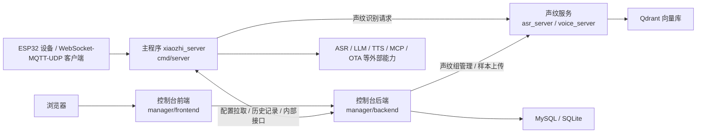

# Hướng Dẫn Biên Dịch và Triển Khai

Tài liệu này dành cho các nhà phát triển cần biên dịch, gỡ lỗi và triển khai dự án từ mã nguồn, bao gồm cách biên dịch và triển khai chương trình chính, frontend/backend bảng điều khiển, và dịch vụ nhận dạng giọng nói.

Khuyến nghị đọc theo thứ tự sau:

- Xem kiến trúc tổng thể trước để hiểu vị trí và quan hệ gọi nhau của từng dịch vụ
- Sau đó lần lượt biên dịch và triển khai theo thứ tự "Chương trình chính -> Backend bảng điều khiển -> Frontend bảng điều khiển -> Dịch vụ nhận dạng giọng nói"
- Cuối cùng, nếu cần tạo gói phát hành tích hợp (AIO), xem phần quy trình đóng gói AIO ở cuối tài liệu

Tài liệu này ưu tiên giới thiệu cách biên dịch và triển khai từng dịch vụ riêng biệt; hình thức AIO được trình bày riêng ở phần sau.

## 1. Mô Tả Phân Tách Dịch Vụ

Trong quá trình phát triển hàng ngày, kiểm thử tích hợp, hoặc khi thay thế một dịch vụ cụ thể, nên sử dụng hình thức triển khai phân tách:

- Chương trình chính: `cmd/server`
- Backend bảng điều khiển: `manager/backend`
- Frontend bảng điều khiển: `manager/frontend`
- Dịch vụ nhận dạng giọng nói: submodule `asr_server`

Bốn thành phần này được biên dịch và khởi động riêng biệt, phù hợp nhất cho phát triển và gỡ lỗi.

Cách đóng gói AIO tích hợp được trình bày ở nửa sau của tài liệu, phù hợp để tạo gói phát hành hoặc gói bàn giao.

## 2. Kiến Trúc Tổng Thể



### 2.1 Vị Trí Của Từng Dịch Vụ Trong Kiến Trúc

| Dịch vụ | Thư mục mã nguồn | Chức năng chính | Cổng thường dùng |
| --- | --- | --- | --- |
| Chương trình chính | `cmd/server` | Tiếp nhận thiết bị, điều phối phiên, lên lịch ASR/LLM/TTS, OTA, WebSocket/MQTT/UDP | `8989` / `2883` / `8990` |
| Backend bảng điều khiển | `manager/backend` | API quản lý, quản lý cấu hình, lịch sử, quản lý nhóm giọng nói | `8080` |
| Frontend bảng điều khiển | `manager/frontend` | Trang quản lý, trình hướng dẫn cấu hình, công cụ kiểm thử | Môi trường phát triển `3000` |
| Dịch vụ nhận dạng giọng nói | `asr_server` | Đăng ký, nhận dạng, xác minh giọng nói, giao diện streaming | Mặc định mã nguồn `9000` |

### 2.2 Quan Hệ Căn Chỉnh Địa Chỉ Quan Trọng

Khi triển khai phân tách, bốn địa chỉ sau phải được căn chỉnh:

| Hướng gọi | Mục cấu hình | Giá trị điển hình |
| --- | --- | --- |
| Frontend -> Backend | `VITE_API_TARGET` | `http://127.0.0.1:8080` |
| Chương trình chính -> Backend bảng điều khiển | `config/config.yaml` -> `manager.backend_url` | `http://127.0.0.1:8080` |
| Backend bảng điều khiển -> Dịch vụ giọng nói | `manager/backend/config/config.json` -> `speaker_service.url` hoặc `SPEAKER_SERVICE_URL` | `http://127.0.0.1:9000` |
| Chương trình chính -> Dịch vụ giọng nói | `config/config.yaml` -> `voice_identify.base_url` | `http://127.0.0.1:9000` |

## 3. Chuẩn Bị Môi Trường

### 3.1 Lấy Mã Nguồn và Submodule

Dịch vụ nhận dạng giọng nói là một Git submodule, sau khi clone lần đầu hãy chạy:

```bash
git submodule update --init --recursive
```

Nếu bạn clone repository mới, nên dùng trực tiếp:

```bash
git clone --recursive <repo-url>
```

### 3.2 Phiên Bản Công Cụ Khuyến Nghị

- Go: `1.24.x`, đồng bộ với `1.24.4` trong CI
- Node.js: `20.x`
- npm: theo Node 20

### 3.3 Phụ Thuộc Chung Khi Biên Dịch Cục Bộ Trên Linux

Cả chương trình chính và dịch vụ nhận dạng giọng nói đều liên quan đến CGO, ONNX Runtime hoặc thư viện động ten-vad. Trên Ubuntu có thể tham khảo:

```bash
sudo apt-get update
sudo apt-get install -y pkg-config libopus0 libopusfile-dev libc++1 libc++abi1
```

Khi biên dịch cục bộ từ mã nguồn của chương trình chính, cần cài thêm ONNX Runtime 1.21.0. Các bước có thể tham khảo trực tiếp phần "Biên dịch cục bộ" trong `README.md` tại thư mục gốc.

### 3.4 Cơ Sở Hạ Tầng Nên Chuẩn Bị Trước

- MySQL: cần thiết khi backend bảng điều khiển sử dụng MySQL
- Qdrant: cần thiết khi dịch vụ nhận dạng giọng nói dùng `qdrant` để lưu trữ

Nếu chỉ xác minh chức năng cục bộ:

- Backend bảng điều khiển có thể dùng SQLite trước
- Dịch vụ nhận dạng giọng nói có thể dùng lưu trữ JSON trước

## 4. Triển Khai Phân Tách: Biên Dịch và Triển Khai Từng Dịch Vụ

### 4.1 Chương Trình Chính

Thư mục mã nguồn: `cmd/server`

### Cấu Hình Quan Trọng

Vị trí mặc định của file cấu hình:

```text
config/config.yaml
```

Khi triển khai từ mã nguồn, các mục thường thay đổi nhất là:

- `manager.backend_url`
- `websocket.host` / `websocket.port`
- `mqtt_server.listen_port`
- `udp.listen_port`
- `voice_identify.enable`
- `voice_identify.base_url`

Nếu dùng triển khai phân tách, khuyến nghị sửa đúng hai mục sau trước:

```yaml
manager:
  backend_url: "http://127.0.0.1:8080"

voice_identify:
  enable: true
  base_url: "http://127.0.0.1:9000"
```

### Biên Dịch

```bash
go mod tidy
go build -o xiaozhi_server ./cmd/server
```

Khi biên dịch cục bộ trên Windows PowerShell với Silero VAD được bật, cần cho CGO tìm thấy header file và import library của ONNX Runtime trước:

```powershell
$env:CGO_ENABLED = "1"
$env:PATH = "C:\msys64\mingw64\bin;$env:PATH"
$env:C_INCLUDE_PATH = "E:\onnxruntime-win-x64-1.21.0\include"
$env:LIBRARY_PATH = "E:\onnxruntime-win-x64-1.21.0\lib"
go mod tidy
go build -o xiaozhi_server.exe ./cmd/server
```

### Khởi Động

```bash
./xiaozhi_server -c config/config.yaml
```

### Khuyến Nghị Triển Khai

1. Trong chế độ triển khai phân tách, chương trình chính không chịu trách nhiệm quản lý tiến trình của frontend/backend bảng điều khiển và dịch vụ nhận dạng giọng nói.
2. Trước khi khởi động chương trình chính, nên đảm bảo backend bảng điều khiển đã có thể truy cập, nếu không provider cấu hình `manager` sẽ thất bại khi kéo cấu hình.
3. Nếu thiết bị dùng WebSocket, địa chỉ tiếp nhận chính thường là `ws://<host>:8989/xiaozhi/v1/`.

### 4.2 Backend Bảng Điều Khiển

Thư mục mã nguồn: `manager/backend`

### Cấu Hình Quan Trọng

Vị trí mặc định của file cấu hình:

```text
manager/backend/config/config.json
```

Chú ý các mục chính:

- `database.type`: `mysql` hoặc `sqlite`
- `database.mysql` / `database.sqlite`
- `speaker_service.url`
- `history.audio_base_path`

Các biến môi trường được hỗ trợ để ghi đè:

- `DB_HOST`
- `DB_PORT`
- `DB_USER`
- `DB_PASSWORD`
- `DB_NAME`
- `SPEAKER_SERVICE_URL`
- `AUDIO_BASE_PATH`

### Biên Dịch

```bash
cd manager/backend
go mod tidy
go build -o main .
```

### Khởi Động

```bash
cd manager/backend
./main -c config/config.json
```

Trong môi trường phát triển cũng có thể chạy trực tiếp:

```bash
cd manager/backend
go run main.go -c config/config.json
```

### Khuyến Nghị Triển Khai

1. Ưu tiên dùng SQLite khi gỡ lỗi cục bộ để giảm phụ thuộc.
2. Khi kiểm thử tích hợp chức năng nhận dạng giọng nói, hãy đảm bảo `speaker_service.url` đã trỏ đến dịch vụ nhận dạng giọng nói.
3. Sau khi backend bảng điều khiển khởi động, cả chương trình chính và frontend đều nên trỏ đến dịch vụ này.

### 4.3 Frontend Bảng Điều Khiển

Thư mục mã nguồn: `manager/frontend`

Frontend bảng điều khiển chủ yếu dùng cho phát triển và kiểm thử tích hợp cục bộ, chỉ cần cài dependencies rồi khởi động server phát triển:

```bash
cd manager/frontend
npm ci
npm run dev
```

Địa chỉ phát triển mặc định:

- Trang frontend: `http://127.0.0.1:3000`
- Đích proxy API: `http://127.0.0.1:8080`

Nếu cần thay đổi đích proxy, có thể đặt:

```bash
VITE_API_TARGET=http://127.0.0.1:8080
```

Hoặc sửa `manager/frontend/.env`.

### 4.4 Dịch Vụ Nhận Dạng Giọng Nói

Thư mục mã nguồn: `asr_server`

### Mô Tả Quan Trọng

`asr_server` là một submodule, khi chạy riêng từ mã nguồn sẽ mặc định đọc:

```text
asr_server/config.json
```

Cổng mặc định trong cấu hình submodule hiện tại là `9000`. Khi triển khai thực tế, phải đảm bảo đồng bộ với địa chỉ dịch vụ nhận dạng giọng nói trong chương trình chính và backend bảng điều khiển.

### Cấu Hình Quan Trọng

Chú ý các mục chính:

- `server.port`
- `speaker.enabled`
- `speaker.storage_type`
- `speaker.qdrant.host`
- `speaker.qdrant.port`
- `speaker.qdrant.collection_name`
- `speaker.model_path`

Lựa chọn phổ biến:

1. Phát triển và kiểm thử tích hợp: `speaker.storage_type = "json"`
2. Triển khai sản xuất: `speaker.storage_type = "qdrant"`

### Biên Dịch Từ Mã Nguồn

Linux / macOS:

```bash
cd asr_server
go mod tidy
CGO_ENABLED=1 go build -o voice_server main.go
```

Windows PowerShell:

```powershell
cd asr_server
$env:CGO_ENABLED=1
go mod tidy
go build -o voice_server.exe main.go
```

### Khởi Động

Linux / macOS:

```bash
cd asr_server
export LD_LIBRARY_PATH="$PWD/lib:$PWD/lib/ten-vad/lib/Linux/x64:${LD_LIBRARY_PATH:-}"
./voice_server
```

Windows:

```powershell
cd asr_server
.\voice_server.exe
```

### Khuyến Nghị Triển Khai

1. Khi phát triển cục bộ, dùng lưu trữ JSON để chạy thông giao diện trước, sau đó chuyển sang Qdrant.
2. Nếu chương trình chính đã bật `voice_identify.enable=true`, hãy đồng thời sửa `voice_identify.base_url` trong chương trình chính.
3. `speaker_service.url` của backend bảng điều khiển cũng phải trỏ đến cùng địa chỉ dịch vụ nhận dạng giọng nói.

### 4.5 Thứ Tự Khởi Động Khuyến Nghị

Tài liệu này giới thiệu theo thứ tự "Chương trình chính -> Backend bảng điều khiển -> Frontend bảng điều khiển -> Dịch vụ nhận dạng giọng nói", nhưng khi khởi động thực tế nên theo thứ tự phụ thuộc:

1. MySQL / SQLite
2. Qdrant
3. Dịch vụ nhận dạng giọng nói `asr_server`
4. Backend bảng điều khiển `manager/backend`
5. Chương trình chính `cmd/server`
6. Frontend bảng điều khiển `manager/frontend`

## 5. Quy Trình Đóng Gói AIO Đồng Bộ Với Release

Nếu mục tiêu của bạn là tái tạo gói phát hành của repository hiện tại thay vì triển khai phân tách, nên thực hiện theo tư duy CI.

Trước khi bắt đầu đóng gói AIO, hãy xác nhận rằng bạn đã hiểu và chạy thành công quy trình triển khai phân tách trong Chương 4.

Hình thức AIO của repository hiện tại sẽ build frontend trước, sau đó dùng Go build tags để đưa các khả năng sau vào chương trình chính:

- `manager`
- `asr_server`
- `embed_ui`

Do đó, `xiaozhi_server` trong sản phẩm cuối cùng thực chất là "chương trình chính + backend bảng điều khiển + dịch vụ nhận dạng giọng nói + frontend bảng điều khiển đã nhúng".

### 5.1 Build Frontend Trước

```bash
cd manager/frontend
npm ci
npm run build
```

Sau đó copy sản phẩm frontend vào thư mục static của backend:

```bash
mkdir -p ../backend/static/dist
cp -r dist/* ../backend/static/dist/
```

### 5.2 Biên Dịch Chương Trình Chính Với Dịch Vụ Nhúng

Quay về thư mục gốc của repository và thực hiện:

```bash
go mod tidy
go build -tags "nolibopusfile asr_server manager embed_ui" -ldflags "-s -w" -o xiaozhi_server ./cmd/server
```

### 5.3 Khởi Động Gói AIO

Khi CI đóng gói, các file sau sẽ được đặt cùng vào thư mục phát hành:

- `main_config.yaml`
- `manager.json`
- `asr_server.json`
- `models/`
- `data/`

Khi chạy thủ công cục bộ có thể tham khảo:

```bash
./xiaozhi_server \
  -c main_config.yaml \
  -manager-config manager.json \
  -asr-config asr_server.json
```

### 5.4 Ghi Chú Bổ Sung Về Đóng Gói AIO

Khi phát hành thực tế thường cần thực hiện thêm:

- Đóng gói thư viện runtime ten-vad / sherpa-onnx
- Copy `models/`, `data/`, cấu hình mẫu
- Đổi tên thư mục theo nền tảng và nén lại

## 6. Hướng Dẫn Sử Dụng Cơ Bản Sau Khi Triển Khai Hoàn Tất

### 6.1 Mở Bảng Điều Khiển

Sau khi triển khai xong, truy cập bằng trình duyệt:

```text
http://<IP hoặc tên miền máy chủ>:8080
```

Nếu frontend và backend được tách riêng và chưa có reverse proxy thống nhất, hãy truy cập theo cổng phát hành frontend của bạn.

### 6.2 Hoàn Thành Cấu Hình Cơ Bản

Lần đầu vào, nên hoàn thành theo trình hướng dẫn cấu hình bảng điều khiển:

1. Địa chỉ OTA
2. Cấu hình VAD
3. Cấu hình ASR
4. Cấu hình LLM
5. Cấu hình TTS

### 6.3 Xác Minh Dịch Vụ Nhận Dạng Giọng Nói

Nếu cần nhận dạng giọng nói:

1. Tạo nhóm giọng nói trong bảng điều khiển
2. Upload file âm thanh mẫu
3. Xác nhận backend bảng điều khiển có thể truy cập dịch vụ nhận dạng giọng nói
4. Xác nhận `voice_identify.enable=true` trong chương trình chính
5. Xác nhận `voice_identify.base_url` trong chương trình chính trỏ đến địa chỉ đúng

### 6.4 Kết Nối Thiết Bị

Thông tin tiếp nhận thiết bị thường gặp như sau:

- WebSocket: `ws://<host>:8989/xiaozhi/v1/`
- Giao diện OTA: `http://<host>:8989/xiaozhi/ota/`
- MQTT: `<host>:2883`
- UDP: `<host>:8990`

### 6.5 Vòng Lặp Kiểm Thử Tích Hợp Tối Thiểu

Khuyến nghị thực hiện một lần kiểm thử smoke theo thứ tự sau:

1. Mở bảng điều khiển, xác nhận trang có thể tải được.
2. Hoàn thành một bộ cấu hình VAD / ASR / LLM / TTS khả dụng trong bảng điều khiển.
3. Xác nhận trong log chương trình chính đã kéo thành công cấu hình từ bảng điều khiển.
4. Nếu bật nhận dạng giọng nói, upload mẫu trong bảng điều khiển trước, sau đó kiểm thử nhận dạng.
5. Để thiết bị lấy địa chỉ WebSocket hoặc MQTT/UDP qua OTA và kết nối vào chương trình chính.

## 7. Các Vấn Đề Thường Gặp

### 7.1 Địa Chỉ Dịch Vụ Nhận Dạng Giọng Nói Không Đồng Bộ

Vấn đề phổ biến nhất là hai địa chỉ sau chưa được sửa cùng lúc:

- `manager/backend/config/config.json` -> `speaker_service.url`
- `config/config.yaml` -> `voice_identify.base_url`

### 7.2 Quên Khởi Tạo Submodule

Nếu `asr_server/server/setup.go` không tồn tại, có nghĩa là submodule chưa được kéo về, cả biên dịch AIO lẫn biên dịch Release đều sẽ thất bại.

### 7.3 Lẫn Lộn Giữa "Triển Khai Phân Tách" và "Gói AIO"

Hãy nhớ:

- Triển khai phân tách: bốn dịch vụ được build và chạy riêng biệt
- Đóng gói AIO: frontend, backend, dịch vụ nhận dạng giọng nói được biên dịch chung vào `xiaozhi_server`

Xác định rõ hình thức mục tiêu trước, rồi mới quyết định lệnh build và file cấu hình.
