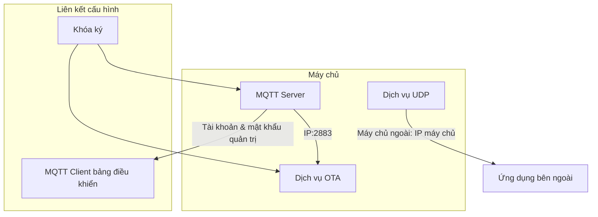
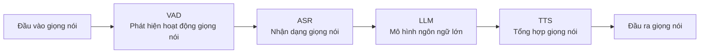

# Hướng Dẫn Triển Khai và Sử Dụng Backend ESP32 Tiểu Trí AI
Hướng dẫn này cung cấp quy trình triển khai đầy đủ để sử dụng dự án này làm backend trên ESP32, bao gồm ba phần chính: triển khai máy chủ, cấu hình thiết bị và cấu hình bảng điều khiển.
## 1. Triển Khai Máy Chủ
Có hai cách triển khai máy chủ: triển khai trực tiếp trên máy và triển khai qua Docker.
### Triển Khai Docker
Bạn có thể thực hiện triển khai Docker theo một trong hai cách sau:
*   **Cách 1 (Khuyến nghị - bao gồm bảng điều khiển)**: [Hướng dẫn nhanh Docker Compose »](doc/docker_compose.md)
*   **Cách 2 (Chỉ dịch vụ, không có bảng điều khiển)**: [Hướng dẫn nhanh Docker »](doc/docker.md)

**Lưu ý quan trọng:**
*   Lệnh `docker-compose` là một công cụ độc lập với Docker Engine. Nếu bạn đang dùng phiên bản Docker mới hơn, bạn cũng có thể dùng trực tiếp lệnh `docker compose` (một lệnh con của `docker` CLI) — hai cách này có chức năng tương đương.

**Giải thích ánh xạ cổng dịch vụ:**
Sau khi triển khai, các cổng dịch vụ bên trong container sẽ được ánh xạ ra máy chủ. Cấu hình mặc định như sau:
*   **`8989:8989`**: Cổng dịch vụ WebSocket.
*   **`2883:2883`**: Cổng dịch vụ MQTT.
*   **`8888:8888/udp`**: Cổng dịch vụ UDP.

### Triển Khai Trực Tiếp Trên Máy
Tham khảo README.md

## 2. Cấu Hình Địa Chỉ Cập Nhật OTA cho ESP32

Thiết bị ESP32 hỗ trợ hai cách để cấu hình địa chỉ máy chủ OTA:

### Cách 1: Sửa Qua Cấu Hình WiFi (Áp dụng khi thiết bị đã được triển khai)

Phương pháp này yêu cầu chỉnh sửa thông qua giao diện cấu hình Web của thiết bị.

**Các bước thực hiện:**
1.  Khởi động thiết bị ESP32 để vào chế độ cấu hình WiFi (thiết bị sẽ phát một điểm truy cập AP).
2.  Dùng điện thoại hoặc máy tính kết nối vào điểm truy cập đó, rồi truy cập trang cấu hình trong trình duyệt (địa chỉ thường là `192.168.4.1`).
3.  Tìm tùy chọn liên quan đến **OTA** trên trang.
4.  Sửa địa chỉ máy chủ OTA thành: `http://<IP máy chủ của bạn>:8989/xiaozhi/ota/`
    **Ví dụ**: `http://192.168.1.12:8989/xiaozhi/ota/`
5.  Lưu cấu hình và tiến hành kết nối WiFi.

### Cách 2: Sửa Qua Cấu Hình Biên Dịch

Phương pháp này yêu cầu biên dịch lại firmware ESP32, chỉnh sửa file cấu hình dự án để cài sẵn địa chỉ OTA.

**Các bước thực hiện:**
1.  Trong thư mục dự án ESP32 của bạn, tìm vị trí file cấu hình `config.json`.
2.  Thêm hoặc sửa mục cấu hình địa chỉ máy chủ OTA:
    ```json
    "CONFIG_OTA_URL": "http://<IP máy chủ của bạn>/xiaozhi/ota/"
    ```

## 3. Cấu Hình Bảng Điều Khiển
### Cấu Hình Dịch Vụ


#### Cấu Hình OTA
Sửa khóa ký để khớp với "Khóa ký" trong trang cấu hình MQTT Server.
Có thể chọn có bật cấu hình MQTT hay không; nếu bật, đặt điểm cuối MQTT là IP máy chủ:2883.
#### Cấu Hình MQTT
Nếu dùng MQTT broker tích hợp sẵn, đặt địa chỉ Broker là 127.0.0.1 và số cổng là 2883.
Nếu dùng MQTT bên ngoài, hãy chỉnh sửa theo nhu cầu.
Sửa cấu hình xác thực thành tài khoản quản trị và mật khẩu trong phần cấu hình MQTT Server.

#### Cấu Hình MQTT Server
Đặt cổng lắng nghe là 2883.
Thiết lập tài khoản và mật khẩu quản trị.
Đặt khóa ký giống với khóa ký trên trang cấu hình OTA.

#### Cấu Hình UDP
Đặt cổng lắng nghe là 8888.
Đặt máy chủ ngoài là IP máy chủ của bạn, ví dụ 192.168.1.12.
#### Cấu Hình MCP
MCP Server toàn cục là máy chủ MCP bên ngoài; nếu chưa có máy chủ MCP bên ngoài thì có thể tạm thời bỏ qua phần này.

### Cấu Hình AI

#### Cấu Hình VAD
Sử dụng WebRTC VAD, không cần cấu hình bên ngoài.
#### Cấu Hình ASR
Điền cấu hình ASR; ngay cả với máy chủ triển khai qua Docker cũng không có ASR triển khai cục bộ — bạn có thể tự triển khai thủ công.
Tham khảo hướng dẫn triển khai tại [Hướng dẫn phát triển dịch vụ chuyển giọng nói thời gian thực FunASR](https://github.com/modelscope/FunASR/blob/main/runtime/docs/SDK_advanced_guide_online_zh.md)
#### Cấu Hình LLM
Điền APIKEY của bạn.
#### Cấu Hình TTS
Lưu ý: TTS của Tiểu Trí hiện không còn hoạt động bình thường, khuyến nghị sử dụng edge.
