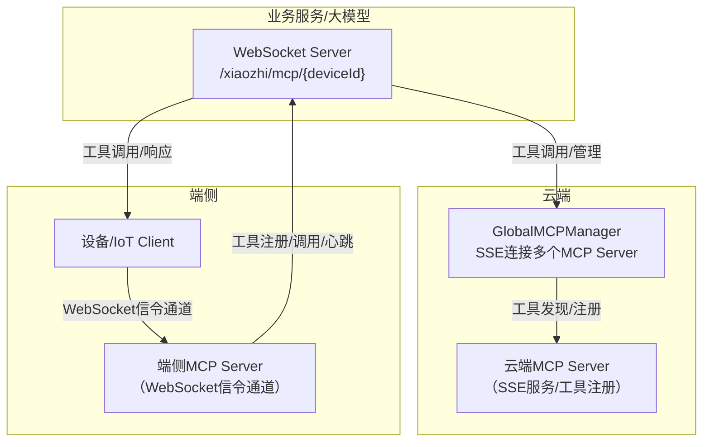

# Tài liệu Chức năng và Logic MCP

## 1. Tổng quan
MCP (Model Context Protocol) là giao thức quản lý và gọi công cụ đa năng được triển khai dựa trên [Eino framework](https://github.com/cloudwego/eino), hỗ trợ đăng ký, khám phá và gọi công cụ ở cấp độ toàn cục và thiết bị, được ứng dụng rộng rãi trong các tình huống hội thoại AI, IoT và nhiều lĩnh vực khác.

## 2. Tính năng
### 🌐 Quản lý công cụ MCP toàn cục
- Hỗ trợ kết nối nhiều máy chủ MCP qua SSE, tự động khám phá và đăng ký công cụ
- Proxy gọi công cụ với giao diện thống nhất
- Giám sát trạng thái kết nối và tự động kết nối lại

### 📱 Quản lý MCP theo thiết bị
- Mỗi thiết bị có kết nối MCP độc lập, hỗ trợ giao thức WebSocket
- Đăng ký và quản lý công cụ dành riêng cho từng thiết bị
- Giới hạn số lượng kết nối và tự động dọn dẹp

### 🔧 Tích hợp Eino Framework
- Triển khai giao diện `tool.InvokableTool`, hỗ trợ gọi công cụ gốc của Eino
- An toàn kiểu dữ liệu, xử lý luồng dữ liệu

## 3. Thiết kế kiến trúc



## 4. Hướng dẫn cấu hình

### Ví dụ config.yaml
```yaml
mcp:
  global:
    enabled: true
    servers:
      - name: "filesystem"
        sse_url: "http://localhost:3001/sse"
        enabled: true
    reconnect_interval: 5
    max_reconnect_attempts: 10
  device:
    enabled: true
    websocket_path: "/xiaozhi/mcp/"
    max_connections_per_device: 5
```

### Giải thích tham số
| Tham số | Kiểu | Mô tả |
|------|------|------|
| mcp.global.enabled | bool | Bật/tắt trình quản lý MCP toàn cục |
| mcp.global.servers | array | Danh sách máy chủ MCP |
| mcp.global.reconnect_interval | int | Khoảng thời gian kết nối lại (giây) |
| mcp.global.max_reconnect_attempts | int | Số lần kết nối lại tối đa |
| mcp.device.enabled | bool | Bật/tắt trình quản lý MCP thiết bị |
| mcp.device.websocket_path | string | Tiền tố đường dẫn WebSocket |
| mcp.device.max_connections_per_device | int | Số kết nối tối đa mỗi thiết bị |

## 5. Giao diện API
### Điểm cuối WebSocket
- Kết nối MCP thiết bị:
  - `ws://<host>:<port>/xiaozhi/mcp/{deviceId}`
  - Sau khi kết nối, máy chủ gửi thông điệp khởi tạo, client phản hồi danh sách công cụ, thiết lập giao tiếp hai chiều
- Ví dụ định dạng thông điệp:
```json
{
  "jsonrpc": "2.0",
  "method": "tools/list",
  "id": 1,
  "params": {}
}
```

### Giao diện REST
- Lấy danh sách công cụ của thiết bị:
  - `GET /xiaozhi/api/mcp/tools/{deviceId}`
  - Ví dụ phản hồi:
```json
{
  "deviceId": "device123",
  "tools": {
    "filesystem_read_file": { "name": "read_file", "description": "Đọc nội dung tệp", "type": "global" },
    "device_sensor_data": { "name": "sensor_data", "description": "Lấy dữ liệu cảm biến", "type": "device" }
  },
  "globalCount": 5,
  "deviceCount": 3,
  "totalCount": 8,
  "timestamp": 1704067200
}
```

## 6. Ví dụ sử dụng điển hình
### Gọi từ phía Go
```go
// Lấy công cụ toàn cục
manager := mcp.GetGlobalMCPManager()
tools := manager.GetAllTools()
for name, tool := range tools {
    result, err := tool.InvokableRun(context.Background(), `{"path": "/tmp/test.txt"}`)
    if err != nil {
        log.Errorf("Gọi công cụ thất bại: %v", err)
        continue
    }
    log.Infof("Kết quả công cụ %s: %s", name, result)
}
```

### Kết nối WebSocket từ phía thiết bị (JS)
```javascript
const ws = new WebSocket('ws://localhost:8989/xiaozhi/mcp/device123');
ws.onopen = function() { console.log('Kết nối MCP đã được thiết lập'); };
ws.onmessage = function(event) {
    const message = JSON.parse(event.data);
    if (message.method === 'initialize') {
        ws.send(JSON.stringify({
            jsonrpc: "2.0",
            id: message.id,
            result: {
                protocolVersion: "2024-11-05",
                serverInfo: { name: "device-mcp-server", version: "1.0.0" }
            }
        }));
    }
};
```

## 7. Các điểm kỹ thuật triển khai chính
- Trình quản lý MCP toàn cục kết nối với nhiều máy chủ MCP qua SSE, tự động khám phá và đăng ký công cụ, hỗ trợ kết nối lại khi mất kết nối và kiểm tra sức khỏe.
- Trình quản lý MCP thiết bị duy trì kết nối độc lập cho từng thiết bị, hỗ trợ WebSocket và giao thức IoT, tự động dọn dẹp các thiết bị offline.
- Công cụ được triển khai thống nhất qua giao diện `InvokableTool`, hỗ trợ xác thực tham số, thử lại khi gọi, định dạng kết quả.
- Khi tích hợp LLM, tự động lấy tất cả công cụ MCP và truyền cho mô hình lớn, hỗ trợ phản hồi luồng và vòng khép kín gọi công cụ.
- Xử lý lỗi đầy đủ, hỗ trợ fallback, theo dõi nhật ký và đảm bảo tính tương thích.

## 8. Xử lý sự cố và đề xuất tối ưu
- Kiểm tra trạng thái kết nối SSE/WebSocket, chú ý các lỗi kết nối, đăng ký, gọi trong nhật ký
- Khi gọi công cụ thất bại, kiểm tra định dạng tham số và tình trạng đăng ký công cụ
- Đặt hợp lý khoảng thời gian kết nối lại, số kết nối tối đa, định kỳ dọn dẹp phiên không hợp lệ
- Có thể mở rộng kiểm soát quyền, bật/tắt công cụ động, trả kết quả và các tính năng nâng cao khác

## 9. Tài liệu tham khảo
- [Tài liệu Eino Framework](https://www.cloudwego.io/docs/eino/)
- [Đặc tả giao thức MCP](https://github.com/mark3labs/mcp-go)
- [Đặc tả SSE](https://developer.mozilla.org/en-US/docs/Web/API/Server-sent_events)
- [Giao thức WebSocket](https://tools.ietf.org/html/rfc6455)

## 10. MCP phía thiết bị (Kênh tín hiệu WebSocket)

MCP phía thiết bị kết nối với máy chủ qua kênh tín hiệu WebSocket, thực hiện đăng ký công cụ, gọi và quản lý phiên ở cấp độ thiết bị, phù hợp cho thiết bị biên và các tình huống IoT.

### Quy trình điển hình
1. Thiết bị thiết lập kết nối WebSocket qua `ws://<host>:<port>/xiaozhi/mcp/{deviceId}`.
2. Sau khi nhận kết nối, máy chủ tạo/lấy phiên MCP thiết bị tương ứng (DeviceMcpSession) và khởi tạo instance MCP client.
3. Máy chủ gửi thông điệp khởi tạo qua kênh tín hiệu, phía thiết bị phản hồi và có thể đồng bộ danh sách công cụ.
4. Cả hai bên có thể tương tác gọi công cụ, thông báo, heartbeat, v.v. thông qua giao thức JSON-RPC.
5. Khi kết nối đứt hoặc hết thời gian chờ, tự động dọn dẹp phiên và tài nguyên.

### Giao diện chính và định dạng thông điệp
- Điểm cuối kết nối: `ws://<host>:<port>/xiaozhi/mcp/{deviceId}`
- Thông điệp khởi tạo:
```json
{
  "jsonrpc": "2.0",
  "method": "initialize",
  "id": 1,
  "params": { /* ... */ }
}
```
- Yêu cầu danh sách công cụ:
```json
{
  "jsonrpc": "2.0",
  "method": "tools/list",
  "id": 2,
  "params": {}
}
```
- Yêu cầu/phản hồi gọi công cụ, thông báo, v.v. đều tuân theo đặc tả JSON-RPC 2.0.

### Quản lý phiên và kết nối
- Mỗi ID thiết bị duy trì DeviceMcpSession độc lập, hỗ trợ nhiều loại kết nối MCP (WebSocket, IoT, v.v.).
- Hỗ trợ giới hạn số kết nối tối đa, heartbeat định kỳ (ping), phát hiện và dọn dẹp tự động khi mất kết nối.
- Tự động giải phóng tài nguyên khi ngắt kết nối, đảm bảo hệ thống ổn định.

### Heartbeat và xử lý mất kết nối
- Thiết bị và máy chủ định kỳ gửi thông điệp ping để kiểm tra tính hoạt động của kết nối.
- Nếu quá 2 phút không có heartbeat thì xác định là offline, tự động ngắt kết nối và dọn dẹp phiên.

### Phối hợp thiết bị - đám mây
- MCP phía thiết bị phù hợp cho các tình huống đăng ký công cụ cục bộ trên thiết bị, thu thập dữ liệu thời gian thực, suy luận AI biên.
- MCP phía đám mây phụ trách đăng ký công cụ toàn cục, tổng hợp năng lực đa thiết bị, điều phối thống nhất.
- Cả hai có thể phối hợp cung cấp khả năng gọi công cụ phong phú cho mô hình lớn/hệ thống nghiệp vụ.
