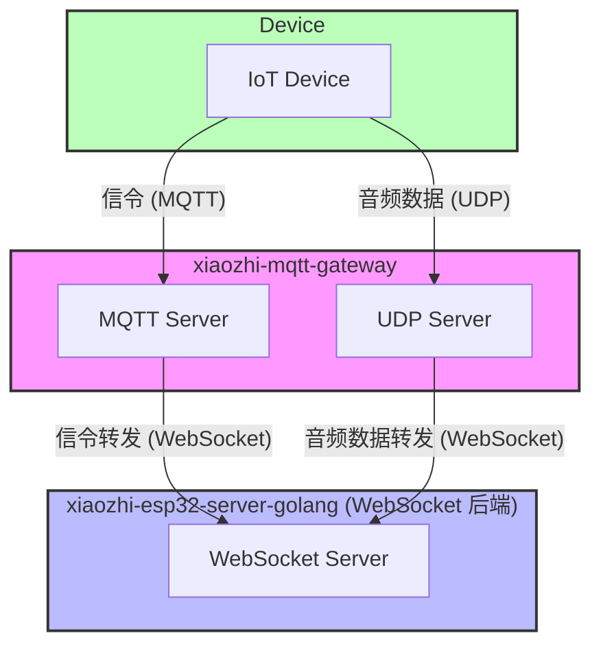

# Hướng Dẫn Cấu Hình MQTT UDP Bridge

---

### Giải Thích Thuật Ngữ

- **xiaozhi-mqtt-gateway:** Dự án mqtt udp bridge chính thức của Xiả Gē, thực hiện chuyển đổi giao thức MQTT và UDP sang WebSocket. Dịch vụ này cho phép thiết bị truyền tải thông điệp điều khiển qua giao thức MQTT, đồng thời truyền dữ liệu âm thanh hiệu quả qua giao thức UDP, và bắc cầu các dữ liệu này sang dịch vụ WebSocket. [xiaozhi-mqtt-gateway](https://github.com/78/xiaozhi-mqtt-gateway) 
- **xiaozhi-esp32-server-golang:** Dự án hiện tại

### Kiến Trúc Tổng Thể




## I. Hướng Dẫn Cấu Hình MQTT UDP Bridge

### Các Bước Cài Đặt
---
1. Sao chép kho mã nguồn
```
git clone 'https://github.com/78/xiaozhi-mqtt-gateway'
cd xiaozhi-mqtt-gateway
```
2. Cài đặt các phụ thuộc
```
npm install
```
3. Tạo tệp cấu hình
```
mkdir -p config
cp config/mqtt.json.example config/mqtt.json
```
4. Chỉnh sửa tệp cấu hình config/mqtt.json, thiết lập các tham số phù hợp

### Mô Tả Cấu Hình
Tệp cấu hình config/mqtt.json cần chứa các nội dung sau:
- `chat_servers`：Điền địa chỉ IP và cổng của máy chủ xiaozhi golang, ***path bắt buộc phải là /xiaozhi/mqtt_udp/v1/***
```
{
  "debug": false,
  "development": {
    "mac_addresss": ["aa:bb:cc:dd:ee:ff"],
    "chat_servers": ["ws://192.168.0.100:8989/xiaozhi/mqtt_udp/v1/"]
  },
  "production": {
    "chat_servers": ["ws://192.168.0.100:8989/xiaozhi/mqtt_udp/v1/"]
  }
}
```

### Biến Môi Trường
Tạo tệp .env và thiết lập các biến môi trường sau:
```
MQTT_PORT=1883              # Cổng máy chủ MQTT
UDP_PORT=8884               # Cổng máy chủ UDP
PUBLIC_IP=192.168.0.100     # IP công khai của máy chủ

#MQTT_SIGNATURE_KEY=mqtt_key # Khóa MQTT, tùy chọn, nếu được cấu hình thì sẽ thực hiện xác thực MQTT, cần giống với khóa được cấu hình trên máy chủ websocket
```

### Chạy Ứng Dụng

##### Môi Trường Phát Triển

```
# Chạy trực tiếp
node app.js

# Chạy ở chế độ debug
DEBUG=mqtt-server node app.js
```

---

## II. Hướng Dẫn Cấu Hình Dịch Vụ Backend xiaozhi golang


### 1. Mô Tả Các Mục Cấu Hình Quan Trọng

#### Tắt Máy Chủ MQTT và UDP Cục Bộ
```yaml
mqtt:
  enable: false
  broker: "127.0.0.1"
  type: "tcp"
  port: 2883
  client_id: "xiaozhi_server"
  username: "admin"
  password: "test!@#"
```

#### Cấu Hình OTA（Thiết bị lấy tham số kết nối qua OTA）
- `ota.signature_key`: Cần giống với ***MQTT_SIGNATURE_KEY*** trong tệp .env của xiaozhi-mqtt-bridge
- `test`/`external`：Phân biệt môi trường mạng nội bộ và bên ngoài
- `websocket.url`：Địa chỉ dịch vụ WebSocket được trả về
- `mqtt.endpoint`：Địa chỉ và cổng dịch vụ MQTT
- `mqtt.enable`：Có bật MQTT hay không（khi là true, thiết bị ưu tiên sử dụng MQTT+UDP）


```yaml
ota:
  signature_key: "mqtt_key"
  test:
    websocket:
      url: "ws://192.168.208.214:8989/xiaozhi/v1/"
    mqtt:
      enable: true
      endpoint: "192.168.208.214:5883"
  external:
    websocket:
      url: "wss://www.tb263.cn:55555/go_ws/xiaozhi/v1/"
    mqtt:
      enable: true
      endpoint: "mqtt.youdomain.cn"
```
---

## III. Tài Liệu Tham Khảo
- [mqtt_udp.md](./mqtt_udp.md)（Kiến trúc, cấu hình và quy trình chi tiết）
- [mqtt_udp_protocol.md](./mqtt_udp_protocol.md)（Giao thức và quy trình dữ liệu）
- [config.md](./config.md)（Mô tả chi tiết các mục cấu hình）
