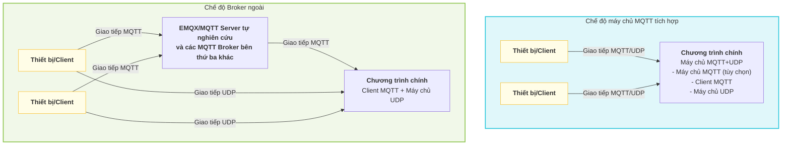

# Quy trình cấu hình máy chủ mqtt udp

Dự án này triển khai **máy chủ MQTT+UDP tự xây dựng**, dùng để xử lý hiệu quả việc truyền dữ liệu âm thanh và các dữ liệu khác giữa thiết bị và máy chủ. Kiến trúc linh hoạt, hỗ trợ nhiều phương thức triển khai và thay thế, phù hợp với các tình huống nghiệp vụ khác nhau.

## 1. Đặc điểm kiến trúc và tính linh hoạt

- **Máy chủ MQTT+UDP tự nghiên cứu**: Dự án tích hợp sẵn máy chủ giao thức MQTT đầy đủ và kênh âm thanh UDP, hỗ trợ thiết bị thiết lập phiên qua MQTT, dữ liệu tiếp theo đi qua UDP, cân bằng giữa độ tin cậy và tính thời gian thực.
- **Các phương thức triển khai tùy chọn cho máy chủ MQTT**:
  - Có thể khởi động như một phần của chương trình chính (server) cùng tiến trình chính, phù hợp cho triển khai tích hợp.
  - Cũng có thể triển khai độc lập như một tiến trình riêng, thuận tiện cho việc mở rộng ngang và cô lập tài nguyên.
- **Hỗ trợ máy chủ MQTT bên thứ ba**:
  - Kiến trúc dự án hỗ trợ thay thế máy chủ MQTT tích hợp bằng các MQTT Broker bên thứ ba như EMQX hoặc MQTT Server tự nghiên cứu.
  - Chỉ cần điều chỉnh tham số `mqtt` liên quan trong tệp cấu hình, chương trình chính có thể kết nối với Broker bên ngoài như một client thuần túy, phù hợp cho các tình huống cluster quy mô lớn và tính sẵn sàng cao.
- **Hỗ trợ tích hợp dự án xiaozhi-mqtt-gateway chính thức của Xiage**
  - Đã thích ứng với dự án mã nguồn mở xiaozhi-mqtt-gateway của Xiage, có thể tích hợp và sử dụng.
  - [Xem chi tiết tại mqtt_bridge.md](./mqtt_bridge.md)

### Sơ đồ kiến trúc triển khai

Sơ đồ dưới đây minh họa hai phương thức triển khai điển hình, giúp hiểu kiến trúc linh hoạt của dự án:



**Giải thích:**
- <b>Chế độ máy chủ MQTT tích hợp</b>: Chương trình chính tích hợp máy chủ MQTT và máy chủ UDP, thiết bị giao tiếp trực tiếp với chương trình chính.
- <b>Chế độ Broker ngoài</b>: Chương trình chính chỉ kết nối với Broker ngoài (EMQX, MQTT Server tự nghiên cứu, v.v.) với vai trò client MQTT, thiết bị chuyển tiếp tin nhắn MQTT qua Broker, dữ liệu UDP vẫn kết nối trực tiếp với chương trình chính.

## 2. Thiết lập tệp cấu hình
Trong `config/config.yaml`, cần chú ý các tham số sau:
- `mqtt`: **Vai trò client**, dùng để cấu hình dịch vụ này kết nối tới Broker với tư cách client MQTT (dù là Broker tích hợp hay bên ngoài).
  - `broker`, `type`, `port`, `client_id`, `username`, `password`
- `mqtt_server`: Tham số máy chủ MQTT tích hợp (chỉ cần bật khi dùng tích hợp trong chương trình chính)
  - `enable`, `listen_host`, `listen_port`, `tls`, v.v.
- `udp`: Tham số kênh UDP
  - `external_host`, `external_port`, `listen_host`, `listen_port`

## 3. Cấu hình liên quan đến OTA

Cấu hình OTA (Over-the-Air) dùng để thiết bị lấy thông tin kết nối như máy chủ, MQTT, WebSocket từ xa, cũng như các tham số nâng cấp firmware và kích hoạt. Tùy theo môi trường mạng của thiết bị (mạng nội bộ/mạng công cộng), có thể tự động trả về các thông tin cấu hình OTA khác nhau.

- Vị trí cấu hình: Trường `ota` trong `config/config.yaml`.
- Cấu trúc điển hình:
  ```yaml
  ota:
    test:
      websocket:
        url: "ws://192.168.208.214:8989/xiaozhi/v1/"
      mqtt:
        enable: false
        endpoint: "192.168.208.214"
    external:
      websocket:
        url: "wss://www.tb263.cn:55555/go_ws/xiaozhi/v1/"
      mqtt:
        enable: false
        endpoint: "www.youdomain.cn"
  ```
- Giải thích các tham số chính:
  - `test`: Thông tin OTA trả về trong môi trường mạng nội bộ/kiểm thử.
  - `external`: Thông tin OTA trả về trong môi trường mạng công cộng/sản xuất.
  - `websocket.url`: Địa chỉ dịch vụ WebSocket mà thiết bị lấy qua OTA.
  - `mqtt.endpoint`: Địa chỉ máy chủ MQTT mà thiết bị lấy qua OTA.
  - `mqtt.enable`: Có bật MQTT hay không (có thể dùng để chuyển đổi động).
- Ứng dụng điển hình:
  - Khi thiết bị khởi động lần đầu hoặc nâng cấp, lấy thông tin kết nối máy chủ và thông tin firmware mới nhất qua giao diện OTA.
  - Hỗ trợ tự động phân biệt mạng nội bộ và mạng ngoài dựa trên IP thiết bị, trả về các tham số kết nối khác nhau, thuận tiện cho việc cô lập môi trường kiểm thử và sản xuất.

**Lưu ý:**
- Giao diện OTA thường là `/xiaozhi/ota/`, cần mở route tương ứng trên WebSocket server.
- Thiết bị cần gửi `Device-Id` và `Client-Id` trong header yêu cầu.
- Có thể kết hợp với cơ chế kích hoạt, trả về mã kích hoạt, mã thách thức, v.v. để tăng cường bảo mật thiết bị.

## 4. Quy trình khởi động và vận hành

1. **Khởi tạo dịch vụ**  
   Khi khởi động chương trình chính, tự động khởi tạo WebSocket, MQTT Server (tùy chọn), và dịch vụ mqtt udp theo cấu hình.
2. **Quy trình khởi động dịch vụ MQTT+UDP**  
   - Đọc các tham số mqtt, udp từ tệp cấu hình.
   - Nếu `mqtt_server.enable=true`, khởi động máy chủ MQTT tích hợp, ngược lại chỉ kết nối với Broker ngoài với tư cách client.
   - Khởi động máy chủ UDP, lắng nghe `udp.listen_port`, hiển thị ra ngoài `udp.external_host:external_port`.
   - Tạo client MQTT (**vai trò client**), kết nối tới Broker đã cấu hình.
   - Khi thiết bị kết nối vào `mqtt_server` tích hợp, máy chủ sẽ tạo trước hoặc tái sử dụng MQTT transport qua tin nhắn lifecycle, và cố gắng tối đa để làm ấm MCP phía thiết bị.
   - Sau khi client gửi tin nhắn `hello` qua MQTT, máy chủ trả về các tham số cấp phiên như `audio_params`, thông tin UDP, v.v. và thiết lập phiên UDP, dữ liệu âm thanh và các dữ liệu tiếp theo được truyền qua kênh UDP.

## 5. Ví dụ cấu hình

**Chế độ máy chủ MQTT tích hợp** (triển khai tích hợp)
```yaml
mqtt:
  broker: "127.0.0.1"
  type: "tcp"
  port: 2883
  client_id: "xiaozhi_server"
  username: "admin"
  password: "test!@#"
mqtt_server:
  enable: true
  listen_host: "0.0.0.0"
  listen_port: 2883
udp:
  external_host: "127.0.0.1"
  external_port: 8990
  listen_host: "0.0.0.0"
  listen_port: 8990
ota:
  test:
    websocket:
      url: "ws://192.168.208.214:8989/xiaozhi/v1/"
    mqtt:
      enable: false
      endpoint: "192.168.208.214"
  external:
    websocket:
      url: "wss://www.tb263.cn:55555/go_ws/xiaozhi/v1/"
    mqtt:
      enable: false
      endpoint: "www.youdomain.cn"
```

**Kết nối MQTT Broker ngoài (như EMQX/MQTT Server tự nghiên cứu)**
```yaml
mqtt:
  broker: "emqx.example.com"
  type: "tcp"
  port: 1883
  client_id: "xiaozhi_server"
  username: "admin"
  password: "test!@#"
mqtt_server:
  enable: false
udp:
  external_host: "IP công cộng"
  external_port: 8990
  listen_host: "0.0.0.0"
  listen_port: 8990
ota:
  test:
    websocket:
      url: "ws://192.168.1.100:8989/xiaozhi/v1/"
    mqtt:
      enable: false
      endpoint: "192.168.1.100"
  external:
    websocket:
      url: "wss://emqx.example.com/go_ws/xiaozhi/v1/"
    mqtt:
      enable: false
      endpoint: "emqx.example.com"
```

## 6. Tình huống khuyến nghị
- **Triển khai tích hợp**: Phù hợp với quy mô vừa và nhỏ, triển khai đơn máy hoặc container hóa, cấu hình đơn giản, dễ bảo trì.
- **Triển khai phân tán/cluster**: Khuyến nghị tắt máy chủ MQTT tích hợp, sử dụng Broker có tính sẵn sàng cao như EMQX, chương trình chính chỉ kết nối với tư cách client, thuận tiện cho việc mở rộng đàn hồi và cân bằng tải.

---

**Quy trình tóm tắt**: Thiết lập tệp cấu hình → Dịch vụ khởi động tự động tải cấu hình → Khởi động lắng nghe UDP và kết nối MQTT → Khi thiết bị lên online qua MQTT, tạo hoặc tái sử dụng transport và làm ấm MCP → Client thiết lập phiên UDP cấp trò chuyện qua MQTT `hello`.

## 7. Định nghĩa và ánh xạ Topic khi kết nối máy chủ MQTT bên thứ ba như EMQX

Khi kết nối với MQTT Broker bên thứ ba như EMQX, cần tuân theo các quy tắc định nghĩa và ánh xạ Topic sau đây để đảm bảo việc truyền thông dữ liệu giữa thiết bị và máy chủ diễn ra suôn sẻ:

### Định nghĩa Topic phía thiết bị
- **public**: `device-server`  
  > Khi thiết bị publish tin nhắn, máy chủ thực tế sẽ tự động ánh xạ thành `/p2p/device_public/{mac_addr}`, trong đó `{mac_addr}` là địa chỉ MAC của thiết bị.
- **sub**: `null`  
  > Thiết bị không cần chủ động subscribe, máy chủ sẽ tự động subscribe `/p2p/device_sub/{mac_addr}` cho thiết bị.

### Định nghĩa Topic phía máy chủ
- **public**: `/p2p/device_sub/{mac_addr}`  
  > Khi máy chủ gửi tin nhắn tới thiết bị cụ thể, cần publish lên Topic này.
- **sub**: `/p2p/device_public/#`  
  > Máy chủ cần subscribe Topic wildcard này để nhận tin nhắn từ tất cả thiết bị.
- **lifecycle**: `/p2p/device_public/_server/lifecycle`
  > Khi `mqtt_server` tích hợp có thiết bị kết nối hoặc ngắt kết nối, sẽ publish sự kiện lifecycle qua Topic được giữ lại này, để chương trình chính duy trì transport, trạng thái online và làm ấm MCP.

#### Giải thích ánh xạ Topic
- Topic phía thiết bị và phía máy chủ sử dụng cơ chế ánh xạ tự động, thiết bị chỉ cần quan tâm đến `device-server`, không cần biết đường dẫn P2P thực tế, máy chủ sẽ tự động hoàn thành việc chuyển đổi Topic dựa trên địa chỉ MAC của thiết bị.
- Cơ chế này thuận tiện cho việc quản lý thiết bị quy mô lớn và cô lập tin nhắn, nâng cao tính bảo mật và khả năng bảo trì của hệ thống.

#### Ví dụ
- Thiết bị A (MAC: 11:22:33:44:55:66)
  - Thiết bị publish: `device-server` → Máy chủ thực tế nhận: `/p2p/device_public/11:22:33:44:55:66`
  - Máy chủ gửi xuống: `/p2p/device_sub/11:22:33:44:55:66`

- Máy chủ subscribe: `/p2p/device_public/#`, có thể nhận tin nhắn từ tất cả thiết bị.

- Ví dụ tin nhắn lifecycle:
  - Topic: `/p2p/device_public/_server/lifecycle`
  - Payload:
    ```json
    {
      "type": "mqtt_lifecycle",
      "device_id": "11:22:33:44:55:66",
      "state": "online",
      "client_id": "GID_test@@@11_22_33_44_55_66@@@uuid",
      "ts": 1710000000000
    }
    ```

> **Lưu ý:**
> - Các quy tắc ánh xạ Topic trên chỉ có hiệu lực khi kết nối với MQTT Broker bên thứ ba như EMQX.
> - Nếu sử dụng máy chủ MQTT tích hợp, chương trình chính vẫn lắng nghe `/p2p/device_public/#`, trong đó `/p2p/device_public/_server/lifecycle` là Topic dành riêng cho máy chủ, không được tái sử dụng cho tin nhắn nghiệp vụ thiết bị.

### Cấu hình chuyển hướng tin nhắn EMQX

Để thực hiện định tuyến và chuyển tiếp tin nhắn thiết bị tự động, cần cấu hình các quy tắc sau trong EMQX:

#### 1. Cấu hình thêm mới cho tự động subscribe
- **topic**: `/p2p/device_sub/${clientid}`

#### 2. Chuyển tiếp tin nhắn
Thêm một mục trong quy tắc, cấu hình như sau:

**SQL quy tắc**:
```sql
SELECT clientid, payload FROM "device-server"
```

**Tham số cấu hình**:
- **Đầu vào dữ liệu**: `"device-server"`
- **Loại đầu ra hành động**: `"Republish tin nhắn"`
- **topic**: `/p2p/device_public/${clientid}`
- **payload**: `${payload}`

## 8. Quy trình dữ liệu MQTT UDP

Phần này giới thiệu ngắn gọn quy trình tổng thể tương tác dữ liệu giữa thiết bị và máy chủ qua MQTT+UDP, bao gồm các bước then chốt như thiết lập phiên, báo cáo dữ liệu và gửi lệnh xuống.

Để biết giao thức chi tiết và định dạng gói dữ liệu, vui lòng tham khảo: [Tài liệu giao thức và quy trình dữ liệu MQTT UDP](./mqtt_udp_protocol.md)

### Tổng quan quy trình
1. **Thiết bị khởi động**, kết nối máy chủ qua MQTT.
2. **Làm ấm lifecycle**: `mqtt_server` tích hợp publish `/p2p/device_public/_server/lifecycle` khi thiết bị lên online, chương trình chính dựa vào đó tạo hoặc tái sử dụng transport, ánh xạ trạng thái online thiết bị, và cố gắng tối đa để làm ấm MCP phía thiết bị.
3. **Thiết bị gửi `hello`**: Máy chủ phản hồi và gửi xuống các tham số cấp phiên như `audio_params`, địa chỉ UDP, khóa và nonce.
4. **Báo cáo âm thanh/dữ liệu**: Thiết bị tải lên âm thanh và các dữ liệu khác hiệu quả qua kênh UDP.
5. **Máy chủ gửi lệnh**: Nếu cần gửi lệnh điều khiển, có thể thực hiện qua kênh MQTT hoặc UDP.
6. **Ngắt kết nối và giữ lại**: Khi thiết bị offline sẽ publish sự kiện lifecycle offline, chương trình chính sẽ lập tức ánh xạ trạng thái offline, nhưng sẽ tái sử dụng transport đã có trong một khoảng thời gian giữ lại, tránh việc kết nối lại trong thời gian ngắn gây ra tạo và hủy liên tục.

### Ranh giới giữa sự kiện lifecycle và `hello`
- Sự kiện MQTT lifecycle chịu trách nhiệm duy trì tài nguyên cấp kết nối, bao gồm tạo trước transport, ánh xạ trạng thái online, làm ấm MCP và thu hồi chậm trễ khi offline.
- `hello` vẫn chỉ chịu trách nhiệm khởi tạo cấp trò chuyện, bao gồm `audio_params`, thương lượng UDP, tham số lấy mẫu và chuẩn bị trạng thái cấp phiên.
- Ngữ nghĩa tín hiệu hiện có như `listen`, `abort`, `goodbye` không thay đổi, vẫn lấy hoàn thành `hello` làm tiền đề.

> Để biết chi tiết về thiết kế Topic, cấu trúc gói dữ liệu, chuyển đổi trạng thái, v.v., vui lòng xem [mqtt_udp_protocol.md](./mqtt_udp_protocol.md).
