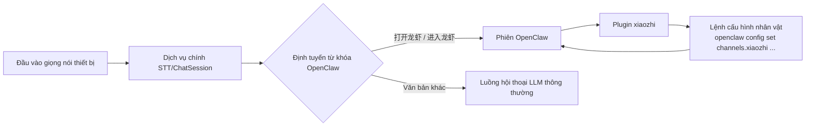

# Hướng dẫn tích hợp OpenClaw

## Sơ đồ kiến trúc

## Các bước cài đặt

1. Đảm bảo OpenClaw đã hoạt động bình thường.
2. Trong hộp thoại `Cài đặt OpenClaw` của agent, sao chép lệnh cấu hình nhân vật — hệ thống sẽ tự động điền WebSocket URL của dịch vụ hiện tại và JWT token của agent đó.
3. Trong bảng cấu hình nhân vật của console OpenClaw, lần lượt thực thi bốn lệnh sau:
   `openclaw config set channels.xiaozhi.enabled true --strict-json`
   `openclaw config set channels.xiaozhi.url "{url}"`
   `openclaw config set channels.xiaozhi.token "{token}"`
   `openclaw gateway restart`
4. Trong đó `{url}` và `{token}` được thay bằng giá trị thực tế đã sao chép từ hộp thoại; cuối cùng thực thi `openclaw gateway restart` để cấu hình có hiệu lực.

## Cách sử dụng

1. Trong hộp thoại `Cài đặt OpenClaw` của agent, nhấn "Sao chép lệnh".
2. Trong bảng cấu hình nhân vật của console OpenClaw, thực thi bốn lệnh đã sao chép để hoàn tất cấu hình `enabled`, `url`, `token` và khởi động lại gateway.
3. Sau khi cài đặt và cấu hình xong, có thể gọi khả năng plugin xiaozhi trong phiên OpenClaw.
4. Trong hộp thoại `Xem openclaw`, có thể dùng "Gửi kiểm tra" để xác minh kết nối và phản hồi.
5. Ở phía thiết bị, có thể dùng `打开龙虾` / `进入龙虾` để vào chế độ OpenClaw, và dùng `关闭龙虾` / `退出龙虾` để thoát khỏi chế độ.

## Gợi ý khắc phục sự cố

- Trạng thái hiển thị chưa kết nối: xác nhận `channels.xiaozhi.url` và `channels.xiaozhi.token` đang sử dụng giá trị mới nhất, và `channels.xiaozhi.enabled` đã được đặt thành `true`.
- Kiểm tra hội thoại bị timeout: kiểm tra xem bốn lệnh cấu hình nhân vật đã thực thi thành công chưa, URL/token có đúng không, đã thực thi `openclaw gateway restart` chưa, và phiên OpenClaw có đang trực tuyến không.
