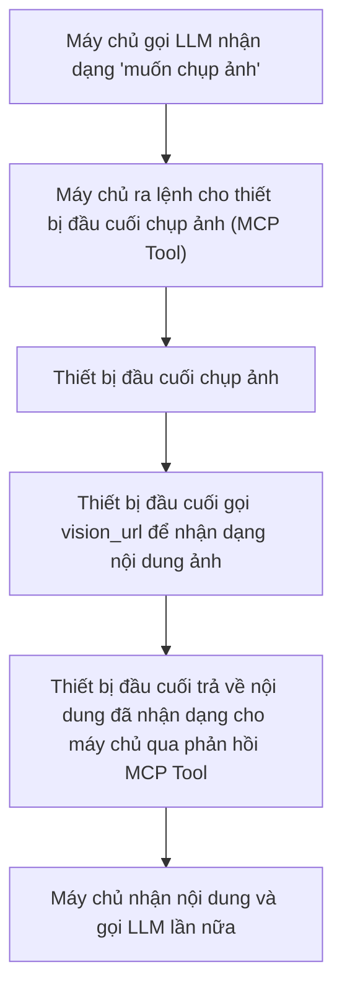

# Quy trình cấu hình nhận dạng hình ảnh và hướng dẫn sử dụng

## 1. Giới thiệu tính năng

Hệ thống hỗ trợ tính năng nhận dạng hình ảnh, chủ yếu thông qua việc gọi các dịch vụ nhận dạng hình ảnh bên ngoài (như Aliyun Qwen-VL, Volcano Doubao Vision, v.v.) để thực hiện khả năng hiểu hình ảnh và nhận dạng nội dung. Các tham số liên quan có thể được điều chỉnh linh hoạt thông qua tệp cấu hình.

## 2. Vị trí tệp cấu hình

Tệp cấu hình liên quan đến nhận dạng hình ảnh nằm tại:

- `config/config.yaml`: Tệp cấu hình chính, chứa các tham số liên quan đến vision.

## 3. Mô tả các tham số chính

Ví dụ cấu hình vision trong `config/config.yaml`:

```yaml
vision:
  enable_auth: false
  vision_url: "http://192.168.208.214:8989/xiaozhi/api/vision"
  vllm:
    provider: "aliyun_vision"
    aliyun_vision:
      type: "openai"
      model_name: "qwen-vl-plus-latest"
      base_url: "https://dashscope.aliyuncs.com/compatible-mode/v1"
      api_key: "api_key"
      max_token: 500
    doubao_vision:
      type: "openai"
      model_name: "doubao-1.5-vision-lite-250315"
      api_key: "api_key"
      base_url: "https://ark.cn-beijing.volces.com/api/v3"
      max_tokens: 500
```

- `enable_auth`: Có bật xác thực cho giao diện nhận dạng hình ảnh hay không.
- `vision_url`: **Địa chỉ HTTP trả về cho client để nhận dạng hình ảnh**, client sử dụng địa chỉ này để tải ảnh lên và nhận kết quả nhận dạng.
- `vllm.provider`: Chỉ định dịch vụ nhận dạng hình ảnh hiện đang sử dụng (ví dụ: aliyun_vision, doubao_vision).
- `aliyun_vision`/`doubao_vision`: Các tham số kết nối của từng dịch vụ nhận dạng hình ảnh, bao gồm:
  - `type`: Loại API (ví dụ: giao diện tương thích openai).
  - `model_name`: Tên mô hình nhận dạng hình ảnh được sử dụng.
  - `base_url`: Địa chỉ API của dịch vụ.
  - `api_key`: Khóa truy cập dịch vụ.
  - `max_token`/`max_tokens`: Số token tối đa.

## 4. Quy trình cấu hình

1. Dựa trên nhu cầu thực tế, chọn và đăng ký dịch vụ nhận dạng hình ảnh cần thiết (như Aliyun, Volcano Doubao, v.v.), lấy API Key.
2. Chỉnh sửa `config/config.yaml`, điền vision_url, provider và các tham số của dịch vụ tương ứng trong trường `vision`.
3. Khởi động dịch vụ, kiểm tra log để xác nhận module nhận dạng hình ảnh được tải thành công.
4. Tải ảnh lên thông qua API hoặc trang giao diện người dùng để xác minh kết quả nhận dạng.

## 5. Các vấn đề thường gặp và cách khắc phục

- **Truy cập giao diện thất bại**: Kiểm tra xem `vision_url` có chính xác không, dịch vụ có đang chạy không.
- **Xác thực thất bại**: Nếu bật xác thực, cần kiểm tra xem `api_key` có chính xác và còn hiệu lực không.
- **Kết quả nhận dạng bất thường**: Xác nhận provider và tên mô hình được điền đúng, API Key còn hiệu lực, dịch vụ bên ngoài khả dụng.

---

Nếu cần bổ sung phương thức gọi API cụ thể, hướng dẫn tích hợp giao diện người dùng hoặc cấu hình cho dịch vụ nhận dạng hình ảnh cụ thể, vui lòng liên hệ với nhà phát triển.

## 6. Các bước quy trình điển hình và sơ đồ luồng

### Mô tả các bước
1. Máy chủ gọi LLM, nhận dạng ý định người dùng là "muốn chụp ảnh".
2. Máy chủ gửi lệnh chụp ảnh đến thiết bị đầu cuối thông qua MCP Tool.
3. Thiết bị đầu cuối nhận lệnh và tiến hành chụp ảnh.
4. Thiết bị đầu cuối gửi ảnh đã chụp đến `vision_url` để nhận dạng nội dung hình ảnh.
5. Thiết bị đầu cuối trả về nội dung hình ảnh đã nhận dạng cho máy chủ dưới dạng phản hồi MCP Tool.
6. Sau khi máy chủ nhận được kết quả chụp ảnh và nhận dạng, có thể gọi LLM một lần nữa để xử lý tiếp theo.

### Sơ đồ luồng

